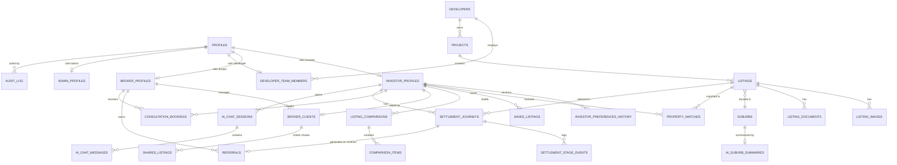

# InvestorSource — Database Design

**Status:** Draft v1.0
**Target:** PostgreSQL via Supabase, with Row-Level Security (RLS) as the primary authorization boundary (see `ARCHITECTURE.md` §4).
**Conventions:** `uuid` primary keys (`gen_random_uuid()`), `timestamptz` for all timestamps, `created_at`/`updated_at` on every table, soft-state via status enums rather than deletes on anything ledger-like (Settlement Accelerator events, referrals, audit log — never `DELETE`d, per PRD NFR "data integrity").

---

## 1. Entity-relationship overview



---

## 2. Identity & profiles

```sql
create type user_role as enum ('investor', 'broker', 'developer', 'admin');

-- Extends Supabase auth.users (1:1). Created via trigger on auth.users insert.
create table profiles (
  id uuid primary key references auth.users(id) on delete cascade,
  role user_role not null,
  full_name text not null,
  email text not null,
  phone text,
  avatar_url text,
  created_at timestamptz not null default now(),
  updated_at timestamptz not null default now()
);

create type experience_level as enum ('first_property', 'experienced_investor');
create type growth_yield_preference as enum ('growth_focused', 'balanced', 'yield_focused');
create type occupier_intent as enum ('investment', 'owner_occupier');
create type finance_status as enum ('pre_approved', 'applying', 'not_started', 'cash_buyer');
create type purchase_timeframe as enum ('immediate', 'within_3_months', 'within_6_months', 'within_12_months', 'researching');

create table investor_profiles (
  id uuid primary key references profiles(id) on delete cascade,
  budget_max numeric(12,2) not null,
  deposit_available numeric(12,2) not null,
  preferred_states text[] not null default '{}',        -- e.g. {'VIC','QLD'}
  preferred_suburbs text[] not null default '{}',        -- free-select, references suburbs.name (not FK-constrained to allow typo-tolerant entries pending suburb-table match)
  experience experience_level not null,
  growth_yield_preference growth_yield_preference not null,
  growth_yield_score smallint not null default 50 check (growth_yield_score between 0 and 100), -- 0=full yield, 100=full growth; drives lib/matching/score.ts
  occupier_intent occupier_intent not null default 'investment',
  finance_status finance_status not null,
  timeframe purchase_timeframe not null,
  onboarding_completed_at timestamptz,
  referred_by_broker_id uuid references profiles(id),     -- set at signup if arrived via broker referral link, see broker_clients
  created_at timestamptz not null default now(),
  updated_at timestamptz not null default now()
);

-- Append-only version history every time onboarding answers are edited (FR-2 re-run trigger)
create table investor_preferences_history (
  id uuid primary key default gen_random_uuid(),
  investor_id uuid not null references investor_profiles(id) on delete cascade,
  snapshot jsonb not null,           -- full preference set at time of change
  changed_at timestamptz not null default now()
);

create table broker_profiles (
  id uuid primary key references profiles(id) on delete cascade,
  agency_name text not null,
  acl_number text,                   -- Australian Credit Licence / authorised credit rep number
  referral_link_slug text unique not null,
  is_active boolean not null default true,
  created_at timestamptz not null default now(),
  updated_at timestamptz not null default now()
);

create table developers (
  id uuid primary key default gen_random_uuid(),
  legal_name text not null,
  trading_name text,
  abn text not null,
  logo_url text,
  standing_notes text,               -- admin-only free text, e.g. approval-history summary
  is_active boolean not null default true,
  created_at timestamptz not null default now(),
  updated_at timestamptz not null default now()
);

create type developer_team_role as enum ('owner', 'member');

create table developer_team_members (
  id uuid primary key references profiles(id) on delete cascade,
  developer_id uuid not null references developers(id) on delete cascade,
  team_role developer_team_role not null default 'member',
  created_at timestamptz not null default now()
);

create table admin_profiles (
  id uuid primary key references profiles(id) on delete cascade,
  is_super_admin boolean not null default false,   -- super_admin: user/role management; standard admin: approvals/analytics only
  created_at timestamptz not null default now()
);
```

---

## 3. Catalog (developers, projects, listings, suburbs)

```sql
create type listing_status as enum ('draft', 'pending_review', 'approved', 'published', 'rejected', 'paused', 'archived');

create table projects (
  id uuid primary key default gen_random_uuid(),
  developer_id uuid not null references developers(id) on delete cascade,
  name text not null,
  description text,
  primary_state text not null,
  primary_suburb text,
  created_at timestamptz not null default now(),
  updated_at timestamptz not null default now()
);

create table suburbs (
  id uuid primary key default gen_random_uuid(),
  name text not null,
  state text not null,
  postcode text not null,
  growth_driver_notes text,          -- structured summary of infra/upzoning drivers, admin/developer-maintained
  unique (name, state, postcode)
);

create table listings (
  id uuid primary key default gen_random_uuid(),
  project_id uuid not null references projects(id) on delete cascade,
  suburb_id uuid not null references suburbs(id),
  title text not null,
  status listing_status not null default 'draft',
  address_line text,
  land_size_sqm numeric(8,2) not null,
  build_size_sqm numeric(8,2) not null,
  price numeric(12,2) not null,
  deposit_required numeric(12,2) not null,
  rental_estimate_weekly numeric(8,2) not null,
  expected_yield numeric(5,2) generated always as (
    case when price > 0 then round((rental_estimate_weekly * 52 / price) * 100, 2) else 0 end
  ) stored,
  growth_driver_score smallint not null default 50 check (growth_driver_score between 0 and 100),  -- developer-entered, admin-reviewable input to matching (see ARCHITECTURE.md §5.2)
  growth_drivers text[] not null default '{}',      -- structured tags, e.g. {'rail_upgrade','new_town_centre'}
  nearby_infrastructure text[] not null default '{}',
  completion_timeline daterange,                    -- estimated completion window
  property_type text not null,                      -- e.g. 'townhouse','house','duplex'
  submitted_at timestamptz,
  reviewed_at timestamptz,
  reviewed_by uuid references profiles(id),
  rejection_reason text,
  published_at timestamptz,
  created_at timestamptz not null default now(),
  updated_at timestamptz not null default now()
);
create index idx_listings_status on listings(status);
create index idx_listings_suburb on listings(suburb_id);

create table listing_images (
  id uuid primary key default gen_random_uuid(),
  listing_id uuid not null references listings(id) on delete cascade,
  storage_path text not null,        -- Supabase Storage object path in `listing-images` bucket
  sort_order smallint not null default 0,
  is_floor_plan boolean not null default false,
  created_at timestamptz not null default now()
);

create type listing_document_type as enum ('brochure', 'floor_plan', 'contract_template', 'other');

create table listing_documents (
  id uuid primary key default gen_random_uuid(),
  listing_id uuid not null references listings(id) on delete cascade,
  storage_path text not null,        -- `listing-documents` bucket, signed-URL access only
  document_type listing_document_type not null,
  file_name text not null,
  created_at timestamptz not null default now()
);

-- Logged whenever an investor downloads a gated document (FR-5 developer analytics input)
create table document_download_events (
  id uuid primary key default gen_random_uuid(),
  document_id uuid not null references listing_documents(id) on delete cascade,
  investor_id uuid not null references investor_profiles(id) on delete cascade,
  downloaded_at timestamptz not null default now()
);
```

---

## 4. Matching & investor engagement

```sql
create table property_matches (
  id uuid primary key default gen_random_uuid(),
  investor_id uuid not null references investor_profiles(id) on delete cascade,
  listing_id uuid not null references listings(id) on delete cascade,
  total_score numeric(5,4) not null,
  score_breakdown jsonb not null,     -- {growthFit, yieldFit, locationFit, timeframeFit} per ARCHITECTURE.md §5.2
  explanation text not null,          -- plain-language string, v1 template-generated (ARCHITECTURE.md §5.3)
  scoring_version text not null,      -- e.g. 'v1-deterministic-2026.07' — ties explanation to the weight set that produced it
  generated_by text not null default 'deterministic_v1',  -- vs. 'llm_v2' once upgraded
  generated_at timestamptz not null default now(),
  unique (investor_id, listing_id, scoring_version)
);
create index idx_matches_investor on property_matches(investor_id, total_score desc);

create table saved_listings (
  investor_id uuid not null references investor_profiles(id) on delete cascade,
  listing_id uuid not null references listings(id) on delete cascade,
  saved_at timestamptz not null default now(),
  primary key (investor_id, listing_id)
);

create table listing_comparisons (
  id uuid primary key default gen_random_uuid(),
  investor_id uuid not null references investor_profiles(id) on delete cascade,
  name text not null default 'Comparison',
  created_at timestamptz not null default now()
);

create table comparison_items (
  comparison_id uuid not null references listing_comparisons(id) on delete cascade,
  listing_id uuid not null references listings(id) on delete cascade,
  sort_order smallint not null default 0,
  primary key (comparison_id, listing_id)
);
```

---

## 5. Broker relationships & Settlement Accelerator

```sql
create type client_link_source as enum ('referral_link', 'manual_invite', 'admin_assigned');

create table broker_clients (
  id uuid primary key default gen_random_uuid(),
  broker_id uuid not null references broker_profiles(id) on delete cascade,
  investor_id uuid not null references investor_profiles(id) on delete cascade,
  source client_link_source not null,
  linked_at timestamptz not null default now(),
  unique (investor_id)   -- v1: one active broker per investor, per PRD open question — revisit if multi-broker support is needed
);
create index idx_broker_clients_broker on broker_clients(broker_id);

create table shared_listings (
  id uuid primary key default gen_random_uuid(),
  broker_id uuid not null references broker_profiles(id),
  investor_id uuid not null references investor_profiles(id),
  listing_id uuid not null references listings(id),
  shared_at timestamptz not null default now(),
  note text
);

create type booking_status as enum ('requested', 'confirmed', 'completed', 'cancelled');

create table consultation_bookings (
  id uuid primary key default gen_random_uuid(),
  investor_id uuid not null references investor_profiles(id) on delete cascade,
  broker_id uuid references broker_profiles(id),   -- nullable until assigned (round-robin/admin), see ARCHITECTURE.md
  requested_at timestamptz not null default now(),
  scheduled_at timestamptz,
  status booking_status not null default 'requested',
  created_at timestamptz not null default now(),
  updated_at timestamptz not null default now()
);

create type settlement_stage as enum (
  'investor_enquiry',
  'strategy_consultation',
  'finance_assessment',
  'property_selection',
  'contract_signed',
  'construction_updates',
  'settlement_preparation',
  'handover',
  'property_management'
);

create table settlement_journeys (
  id uuid primary key default gen_random_uuid(),
  investor_id uuid not null references investor_profiles(id) on delete cascade,
  broker_id uuid references broker_profiles(id),
  listing_id uuid references listings(id),          -- set once Stage 4 (Property Selection) is reached
  created_at timestamptz not null default now()
  -- current stage is derived from settlement_stage_events, never stored redundantly here (NFR data-integrity)
);

create table settlement_stage_events (
  id uuid primary key default gen_random_uuid(),
  journey_id uuid not null references settlement_journeys(id) on delete cascade,
  stage settlement_stage not null,
  note text,
  actor_id uuid not null references profiles(id),
  is_correction boolean not null default false,      -- true when appended to correct a prior mis-recorded event (never edit/delete, PRD FR-10)
  occurred_at timestamptz not null default now()
);
create index idx_stage_events_journey on settlement_stage_events(journey_id, occurred_at);

-- Convenience view: current stage per journey (latest event), what dashboards actually query
create view investor_journey_view as
  select distinct on (journey_id)
    journey_id, stage as current_stage, occurred_at as stage_entered_at
  from settlement_stage_events
  order by journey_id, occurred_at desc;

create type referral_status as enum ('pending', 'confirmed', 'disputed', 'voided');

create table referrals (
  id uuid primary key default gen_random_uuid(),
  broker_id uuid not null references broker_profiles(id),
  journey_id uuid not null references settlement_journeys(id),
  status referral_status not null default 'pending',
  commission_amount numeric(12,2),    -- manually entered at MVP, per PRD FR-7 (automation deferred)
  notes text,
  created_at timestamptz not null default now(),
  updated_at timestamptz not null default now()
);
```

---

## 6. AI & communications

```sql
create table ai_suburb_summaries (
  id uuid primary key default gen_random_uuid(),
  suburb_id uuid not null references suburbs(id) on delete cascade,
  summary text not null,
  prompt_version text not null,
  generated_at timestamptz not null default now(),
  refresh_due_at timestamptz not null,
  unique (suburb_id)
);

create table ai_chat_sessions (
  id uuid primary key default gen_random_uuid(),
  investor_id uuid not null references investor_profiles(id) on delete cascade,
  started_at timestamptz not null default now()
);

create type chat_message_role as enum ('user', 'assistant', 'system_deflection');

create table ai_chat_messages (
  id uuid primary key default gen_random_uuid(),
  session_id uuid not null references ai_chat_sessions(id) on delete cascade,
  role chat_message_role not null,
  content text not null,
  grounding_context jsonb,     -- what context was injected server-side for this response, for audit/debug (ARCHITECTURE.md §8.1)
  created_at timestamptz not null default now()
);

create type email_trigger_reason as enum (
  'onboarding_confirmation', 'match_ready', 'consultation_confirmed',
  'settlement_stage_change', 'onboarding_no_booking_followup'
);

create table email_automation_log (
  id uuid primary key default gen_random_uuid(),
  recipient_id uuid not null references profiles(id),
  trigger_reason email_trigger_reason not null,
  template_name text not null,
  sent_at timestamptz,
  resend_message_id text,
  created_at timestamptz not null default now()
);
```

---

## 7. Leads, analytics & audit

```sql
-- Pre-onboarding drop-off capture (e.g. partial questionnaire), for funnel analytics only — not a full account
create table leads (
  id uuid primary key default gen_random_uuid(),
  email text,
  phone text,
  partial_answers jsonb,
  utm_source text,
  utm_campaign text,
  created_at timestamptz not null default now()
);

create table audit_log (
  id uuid primary key default gen_random_uuid(),
  actor_id uuid references profiles(id),
  action text not null,              -- e.g. 'listing.approved', 'broker.client_reassigned', 'admin.impersonation_view'
  entity_type text not null,
  entity_id uuid,
  previous_value jsonb,
  new_value jsonb,
  reason text,
  occurred_at timestamptz not null default now()
);
create index idx_audit_entity on audit_log(entity_type, entity_id);
```

---

## 8. Row-Level Security policy design

RLS is enabled on every table above except `suburbs` and `ai_suburb_summaries` (public reference data). Representative policies (full policy SQL lives in migrations, not duplicated here in full — this section documents the *rules*, per table group):

**Helper functions** (in `public` schema, `security definer`, used across policies):
```sql
create function current_role() returns user_role as $$
  select role from profiles where id = auth.uid()
$$ language sql stable security definer;

create function is_broker_of(p_investor_id uuid) returns boolean as $$
  select exists (
    select 1 from broker_clients
    where investor_id = p_investor_id and broker_id = auth.uid()
  )
$$ language sql stable security definer;

create function owns_developer(p_developer_id uuid) returns boolean as $$
  select exists (
    select 1 from developer_team_members
    where id = auth.uid() and developer_id = p_developer_id
  )
$$ language sql stable security definer;
```

| Table | Select policy | Insert/Update policy |
|---|---|---|
| `investor_profiles` | self (`id = auth.uid()`) OR `is_broker_of(id)` OR `current_role() = 'admin'` | self (own row) OR admin |
| `listings` | `status = 'published'` (any authenticated/anon) OR `owns_developer(project.developer_id)` OR `current_role() = 'admin'` | insert/update restricted to `owns_developer(...)` (own listings, any status) OR admin; developers cannot set `status = 'approved'`/`'published'` directly (enforced via a trigger, not just RLS, since a status transition is a business rule, not a pure ownership check) |
| `broker_clients` | `broker_id = auth.uid()` OR `investor_id = auth.uid()` OR admin | insert via Server Action only (service-role, validates referral-link/manual-invite logic), not open client insert |
| `settlement_journeys` / `settlement_stage_events` | investor (own), `is_broker_of(investor_id)`, admin | insert gated by the stage-transition actor rules in `lib/settlement-accelerator/stages.ts`, re-checked via a Postgres trigger that validates `actor_id`'s role is permitted for the target `stage` (defence in depth — app-layer check alone is not sufficient per NFR auditability) |
| `referrals` | `broker_id = auth.uid()` OR admin | admin-only insert/update (broker cannot self-report commission amounts) |
| `ai_chat_sessions` / `ai_chat_messages` | `investor_id = auth.uid()` OR admin | insert via Server Action (service-role after grounding-context assembly), not direct client insert |
| `audit_log` | admin only | insert via `security definer` trigger functions only, no direct client insert ever |

---

## 9. Migration sequencing (build-order alignment)

Per the PRD's build order, migrations are expected to land in this sequence:
1. `profiles`, role enum, auth trigger (`handle_new_user`), `investor_profiles`, `broker_profiles`, `developers`, `developer_team_members`, `admin_profiles`.
2. `suburbs`, `projects`, `listings`, `listing_images`, `listing_documents`.
3. `property_matches`, `saved_listings`, `listing_comparisons`, `comparison_items`.
4. `broker_clients`, `shared_listings`, `consultation_bookings`.
5. `settlement_journeys`, `settlement_stage_events`, `investor_journey_view`, `referrals`.
6. `ai_suburb_summaries`, `ai_chat_sessions`, `ai_chat_messages`, `email_automation_log`.
7. `leads`, `audit_log`, `document_download_events`.
8. RLS enable + policies for every table (can follow immediately after each group above rather than as one final pass, to avoid a window where tables exist without RLS enabled).
