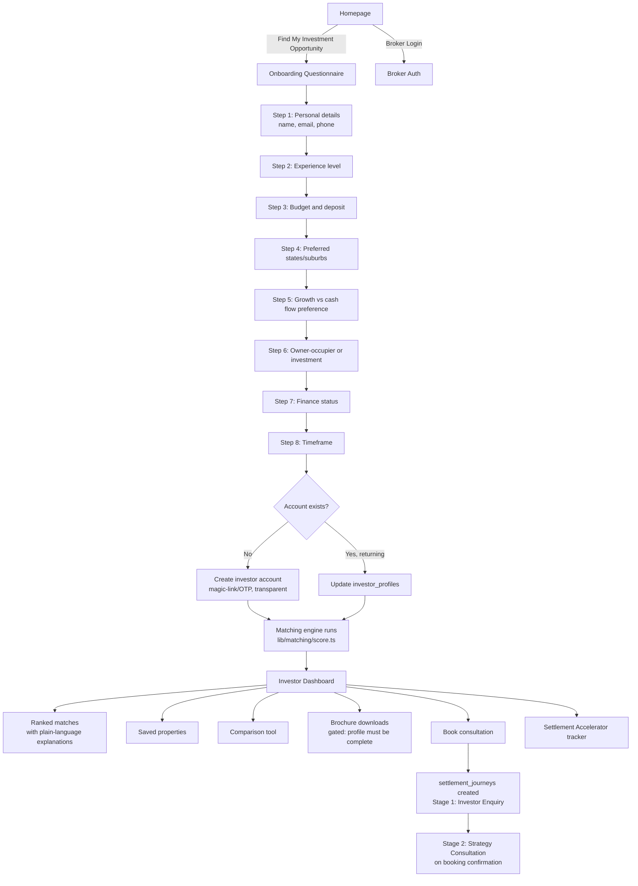
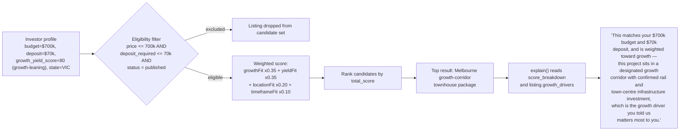
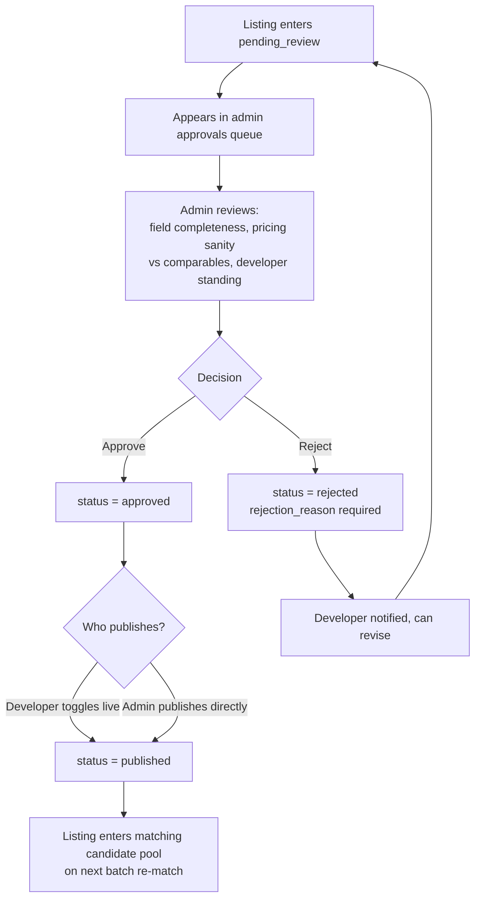
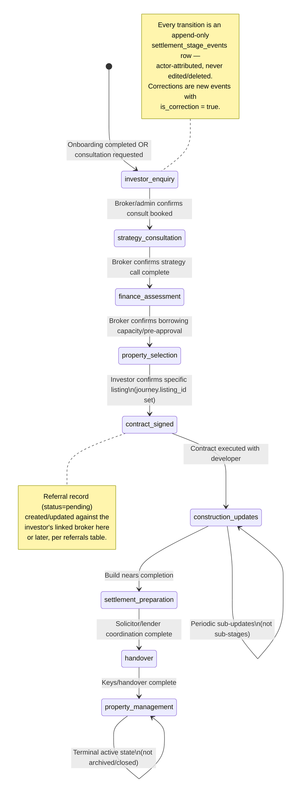
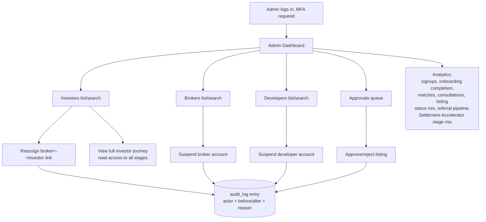
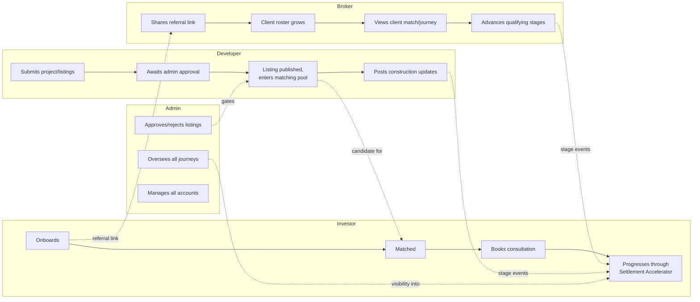

# InvestorSource — User Flow Diagrams

**Status:** Draft v1.0
Companion to `PRD.md` (journeys in §4, requirements FR-1…FR-16) and `ARCHITECTURE.md`. Diagrams use Mermaid.

---

## 1. Investor funnel — homepage to matched dashboard (FR-1, FR-2, FR-3, FR-4)



---

## 2. AI matching — worked example (PRD §4.2)



---

## 3. Broker-referred investor flow (PRD §4.3, FR-6)

```mermaid
sequenceDiagram
    participant Broker
    participant Client as Prospective Investor
    participant Platform
    Broker->>Platform: Generate/share referral link (broker_profiles.referral_link_slug)
    Broker->>Client: Sends link
    Client->>Platform: Opens link, completes onboarding questionnaire
    Platform->>Platform: Create investor account + investor_profiles row
    Platform->>Platform: Insert broker_clients (source=referral_link)
    Platform->>Broker: Client now visible in roster (dashboard/clients)
    Client->>Platform: Views matched dashboard, saves/compares listings
    Broker->>Platform: Opens client detail, sees matches + journey stage
    Broker->>Client: (optional) Shares a specific listing directly
    Platform->>Client: Listing flagged "shared by your broker" on dashboard
    Client->>Platform: Books consultation
    Platform->>Broker: Consultation routed to broker (already linked), notified
    Platform->>Platform: settlement_journeys created, broker_id set
    Note over Platform: Journey progresses; on Stage 5 (Contract Signed)+,<br/>a referrals row is created (status=pending) against the broker
```

---

## 4. Developer submission → admin approval → publish (PRD §4.4, FR-8, FR-9)

```mermaid
stateDiagram-v2
    [*] --> draft: Developer creates listing
    draft --> draft: Developer edits fields,\nuploads images/docs
    draft --> pending_review: Developer submits for review
    pending_review --> approved: Admin approves
    pending_review --> rejected: Admin rejects + reason
    rejected --> pending_review: Developer revises, resubmits\n(new review cycle; prior rejection kept in history)
    approved --> published: Developer or admin publishes
    published --> published: Developer edits price/availability\n(flagged for lightweight re-check,\nnot auto-unpublished)
    published --> paused: Admin pauses\n(sold out / compliance issue)
    paused --> published: Admin resumes
    published --> archived: Admin archives
    paused --> archived: Admin archives
    archived --> [*]

    note right of pending_review
        Never visible to investors,
        matching engine, or filters
        while in draft or pending_review.
    end note
    note right of published
        Only status eligible for
        investor-facing display and
        lib/matching/score.ts candidates.
    end note
```



---

## 5. Admin approval queue operation (FR-9, FR-16)



---

## 6. Settlement Accelerator — full state machine (PRD §4.6, FR-10)



**Stage-advance authorization** (enforced in `lib/settlement-accelerator/stages.ts` and re-validated by a Postgres trigger, per `ARCHITECTURE.md` §6 / `DATABASE_SCHEMA.md` §8):

| Transition | Allowed actors |
|---|---|
| → Investor Enquiry | Investor (via onboarding/consultation request), admin |
| → Strategy Consultation | Broker, admin |
| → Finance Assessment | Broker, admin |
| → Property Selection | Investor, broker, admin |
| → Contract Signed | Broker, admin |
| → Construction Updates (+ sub-updates) | Developer, admin |
| → Settlement Preparation | Broker, admin |
| → Handover | Broker, admin, developer |
| → Property Management | Admin, developer |

---

## 7. Admin journey — cross-cutting oversight (PRD §4.5)



---

## 8. Cross-journey summary (how the four roles intersect)


